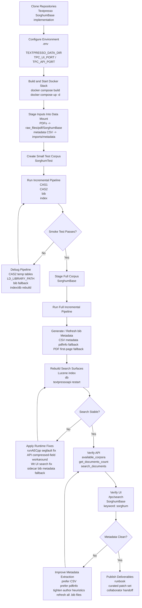

# Textpresso Sorghum Workflow Diagram

This diagram summarizes the SorghumBase ingestion and search-enablement workflow described in the runbook.

## Main Artifacts

- Runbook: [TEXTPRESSO_SORGHUM_RUNBOOK.md](/Users/kchougul/development/codex_projects/Textpresso/sorghumbase_textpresso_implementation/docs/TEXTPRESSO_SORGHUM_RUNBOOK.md)
- Patch guide: [TEXTPRESSO_PATCHSET_GUIDE.md](/Users/kchougul/development/codex_projects/Textpresso/sorghumbase_textpresso_implementation/docs/TEXTPRESSO_PATCHSET_GUIDE.md)
- Curated patch: [textpresso-sorghum-fixes.patch](/Users/kchougul/development/codex_projects/Textpresso/sorghumbase_textpresso_implementation/docs/patches/textpresso-sorghum-fixes.patch)
- Handoff note: [COLLABORATOR_HANDOFF.md](/Users/kchougul/development/codex_projects/Textpresso/sorghumbase_textpresso_implementation/docs/COLLABORATOR_HANDOFF.md)
