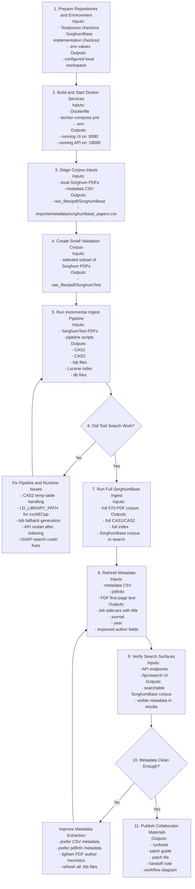

# Textpresso Sorghum Workflow Diagram

This document shows the polished operational workflow for loading SorghumBase literature into Textpresso and making it searchable from both the API and UI.

Important distinction:

- the standalone Dockerfile in this repository validates the Sorghum-side classifier code
- the full searchable Textpresso instance is built and run from the separate `Textpresso` repository using Docker Compose

## Workflow Diagram

## Step-by-Step Inputs and Outputs

| Step | Goal | Main Inputs | Main Outputs |
|---|---|---|---|
| 1. Prepare repositories and environment | Make the local workspace reproducible | `Textpresso` repo, `sorghumbase_textpresso_implementation` repo, `.env` values | a configured local workspace with known paths and ports |
| 2. Build and start Docker services | Bring up Textpresso locally | `Dockerfile`, `docker-compose.yml`, `.env` | running container, UI on `localhost:8080`, API on `localhost:18080` |
| 2a. Validate this repo Dockerfile | Verify the Sorghum helper code in isolation | repository `Dockerfile`, Python package, tests | passing containerized unit tests for this repo |
| 3. Stage corpus inputs | Place literature and metadata into the mounted data directory | Sorghum PDFs, `sorghumbase_papers.csv` | `raw_files/pdf/SorghumBase`, `imports/metadata/sorghumbase_papers.csv` |
| 4. Create small validation corpus | Test the pipeline on a small subset first | 3 representative Sorghum PDFs | `raw_files/pdf/SorghumTest` |
| 5. Run incremental ingest pipeline | Convert PDFs into searchable Textpresso artifacts | staged PDFs, `run_tpc_pipeline_incremental.sh` | `tpcas-1`, `tpcas-2`, `.bib` files, Lucene index, db files |
| 6. Validate test search | Confirm the small corpus is searchable | `SorghumTest`, API/UI search | either passing search results or concrete failures to debug |
| 7. Run full SorghumBase ingest | Load the entire Sorghum corpus | full `SorghumBase` PDF set | full corpus CAS output and index |
| 8. Refresh metadata | Improve displayed metadata for search results | metadata CSV, `pdfinfo`, PDF first-page text, `generate_pdf_bib.py` | rewritten `.bib` sidecars with title, journal, year, and cleaner author fields |
| 9. Verify API and UI | Confirm search works end to end | `available_corpora`, `get_documents_count`, `search_documents`, `/tpc/search` | stable search results for `SorghumBase` |
| 10. Improve metadata if needed | Clean residual bad author/year values | problematic `.bib` records, source PDF metadata | improved metadata and refreshed `.bib` files |
| 11. Publish collaborator materials | Share a reproducible workflow | runbook, patch set, handoff text | versioned docs collaborators can follow |

## Operational Meaning of Inputs and Outputs

- `raw_files/pdf/SorghumBase`: source PDFs arranged one paper per accession directory
- `imports/metadata/sorghumbase_papers.csv`: external metadata source used by `.bib` generation
- `tpcas-1`: first-stage CAS output created from raw PDFs
- `tpcas-2`: second-stage CAS output after UIMA annotation
- `.bib` sidecars: metadata files used by the API and UI to display title, journal, year, author, and abstract
- Lucene index: document and sentence search index used by Textpresso search
- db files: auxiliary document/year lookup files used by the search stack

## Architecture Notes

- This repository documents and supports the Sorghum integration effort.
- The `Textpresso` repository runs the actual search services and ingest pipeline.
- The Sorghum metadata CSV improves `.bib` generation, which in turn improves what users see in API and UI search results.
- The searchable path is: raw PDFs -> CAS1 -> CAS2 -> `.bib` + Lucene index + db files -> API/UI search.

## Related Documents

- Runbook: [TEXTPRESSO_SORGHUM_RUNBOOK.md](/Users/kchougul/development/codex_projects/Textpresso/sorghumbase_textpresso_implementation/sorghumbase_textpresso_implementation/docs/TEXTPRESSO_SORGHUM_RUNBOOK.md)
- Patch guide: [TEXTPRESSO_PATCHSET_GUIDE.md](/Users/kchougul/development/codex_projects/Textpresso/sorghumbase_textpresso_implementation/sorghumbase_textpresso_implementation/docs/TEXTPRESSO_PATCHSET_GUIDE.md)
- Curated patch: [textpresso-sorghum-fixes.patch](/Users/kchougul/development/codex_projects/Textpresso/sorghumbase_textpresso_implementation/sorghumbase_textpresso_implementation/docs/patches/textpresso-sorghum-fixes.patch)
- Handoff note: [COLLABORATOR_HANDOFF.md](/Users/kchougul/development/codex_projects/Textpresso/sorghumbase_textpresso_implementation/sorghumbase_textpresso_implementation/docs/COLLABORATOR_HANDOFF.md)
